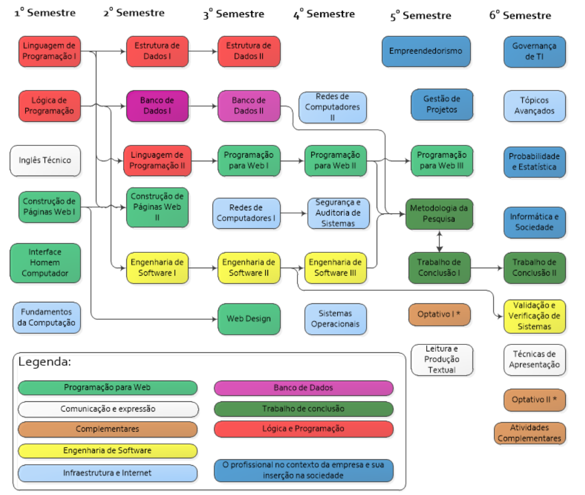

#  Sistemas para Internet
<a href="http://www.poa.ifrs.edu.br/index.php?option=com_content&view=article&layout=edit&id=3206">Página do curso</a>

## <a href="https://www.poa.ifrs.edu.br/?skip=true">  INSTITUTO FEDERAL DE EDUCAÇÃO, CIÊNCIA E TECNOLOGIA - CAMPUS PORTO ALEGRE</a>

<table border="1px">
    <tr>
        <th>1 Sem</th>
        <th>2 Sem</th>
        <th>3 Sem</th>
        <th>4 Sem</th>
        <th>5 Sem</th>
        <th>6 Sem</th>
    </tr>
    <tr>
        <td><a href="https://github.com/icsalgado/superiorSistemasParaInternet_IFRS/tree/master/PrimeiroSemestre/SSI101logicaDeProgramacao">Logica Prog.</a></td>
        <td></td>
        <td></td>
        <td></td>
        <td></td>
        <td></td>
    </tr>
    <tr>
        <td><a href="https://github.com/icsalgado/superiorSistemasParaInternet_IFRS/tree/master/PrimeiroSemestre/SSI102inglesTecnico">Ing. Tec.</a></td>
        <td></td>
        <td></td>
        <td></td>
        <td></td>
        <td></td>
    </tr>
    <tr>
        <td><a href="https://github.com/icsalgado/superiorSistemasParaInternet_IFRS/tree/master/PrimeiroSemestre/SSI103fundamentosDaComputacao">Fund. Comp.</a></td>
        <td></td>
        <td></td>
        <td><a href="https://github.com/icsalgado/superiorSistemasParaInternet_IFRS/tree/master/QuartoSemestre/SSI403sistemasOperacionais">Sist. Oper.</a></td>
        <td></td>
        <td></td>
    </tr>
    <tr>
        <td><a href="https://github.com/icsalgado/superiorSistemasParaInternet_IFRS/tree/master/PrimeiroSemestre/SSI104construcaoDePaginasWeb1">Pg. Web</a></td>
        <td></td>
        <td></td>
        <td></td>
        <td></td>
        <td></td>
    </tr>
    <tr>
        <td><a href="https://github.com/icsalgado/superiorSistemasParaInternet_IFRS/tree/master/PrimeiroSemestre/SSI105LinguagemDeProgramacao1">Ling. Prog. C</a></td>
        <td></td>
        <td></td>
        <td><a href="https://github.com/icsalgado/superiorSistemasParaInternet_IFRS/tree/master/QuartoSemestre/SSI405redesDeComputadores2">Redes 2</a></td>
        <td></td>
        <td></td>
    </tr>
    <tr>
        <td><a href="https://github.com/icsalgado/superiorSistemasParaInternet_IFRS/tree/master/PrimeiroSemestre/SSI106interfaceHomemComputador">Interf. H-C</a></td>
        <td></td>
        <td></td>
        <td></td>
        <td></td>
        <td></td>
    </tr>
</table>

 

